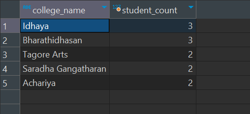
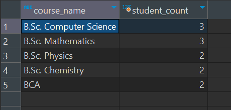

# UNIVERSITY SQL DATABASE

# TASK 1:
-----------------------------------------------------------------
- Build a University students ranking system database.
- University will have multiple colleges
- Each college will have many courses,
- Each Courses will have many subject
- The university follows semester pattern
- Need to store the marks for each subject , semester wise
- design the table structure and relationships
- feed necessary data to query the output
-----------------------------------------------------------------

---------------------------------------------------------------------------------------------------------
TO CREATE UNIVERSITY DATABASE:
---------------------------------------------------------------------------------------------------------

- CREATE DATABASE university
- \l university
   
---------------------------------------------------------------------------------------------------------
TO CREATE TABLE FOR UNIVERSITY , COLLEGE, COURSE , COLLEGE_COURSE , SUBJECT , COURSE_SUBJECT ,    SEMESTER, STUDENT AND MARK:
---------------------------------------------------------------------------------------------------------

- CREATE TABLE university (university_id SERIAL PRIMARY KEY, university_name VARCHAR);

- CREATE TABLE college (college_id SERIAL PRIMARY KEY,college_name VARCHAR,university_id 
INTEGER REFERENCES university(university_id));

- CREATE TABLE course ( course_id SERIAL PRIMARY KEY, course_name VARCHAR);

- CREATE TABLE college_course (college_course_id SERIAL PRIMARY KEY, 
college_id INTEGER REFERENCES college(college_id),course_id INTEGER REFERENCES course(course_id));

- CREATE TABLE subject(subject_id serial primary key not null ,subject_name VARCHAR not null);

- CREATE TABLE course_subject(course_subject_id SERIAL PRIMARY KEY NOT NULL, 
subject_id INTEGER REFERENCES subject(subject_id),course_id INTEGER REFERENCES course(course_id));

- CREATE TABLE semester(semester_id  SERIAL PRIMARY KEY NOT NULL,
sem_month VARCHAR NOT null,sem_year INTEGER NOT null);

- CREATE TABLE student(student_id serial primary key not null,
student_name VARCHAR not null,dob date,phone  bigint, place VARCHAR, 
college_id INTEGER REFERENCES college(college_id),
course_id INTEGER REFERENCES course(course_id),joined_year integer);

- CREATE TABLE marks(mark_id serial primary key not null,
student_id integer references student(student_id),
semester_id integer references semester(semester_id),
marks integer, subject_id INTEGER REFERENCES subject(subject_id));

---------------------------------------------------------------------------------------------------------
 TO INSERT DATA IN UNIVERSITY , COLLEGE, COURSE , COLLEGE_COURSE , SUBJECT , COURSE_SUBJECT ,    SEMESTER, STUDENT AND  MARK TABLES:
---------------------------------------------------------------------------------------------------------

- insert into university(university_name)
values('Pondicherry University');

- insert into college(college_name,university_id)
values('Idhaya',1),('Bharathidhasan',1),('Tagore Arts',1),('Saradha Gangatharan',1),('Achariya',1);

- insert into course(course_name)
values('B.Sc. Computer Science'),('B.Sc. Mathematics'),('B.Sc. Physics'),('B.Sc. Chemistry'),('BCA');

- insert into subject(subject_name)
values('DBMS'),('C programming language'),('Digital Electronics'),('Public Administration'),('Mathematics'),('Trignometry'),
('Differential'),('Calculus'),('Algebra'),('Discrete mathematics'),('Thermodynamics and Statistical Mechanics'),('Electromagnetism and Photonics'),
('Relativistic Mechanics'),('Condensed Matter Physics'),('High-energy Particle Physics and Nuclear Physics'),('Inorganic Chemistry'),('Organic Chemistry'),
('Physical Chemistry'),('Application of Computer in Chemistry'),('Analytical Methods in Chemistry');

- insert into college_course(college_id,course_id) values(1,1),(1,2),(1,3),(1,4),(1,5),(2,1),(2,2),(2,3),(2,4),(2,5),
(3,1),(3,2),(3,3),(3,4),(3,5),(4,1),(4,2),(4,3),(4,4),(4,5),(5,1),(5,2),(5,3),(5,4),(5,5);

- insert into course_subject(subject_id,course_id) values(1,1),(2,1),(3,1),(4,1),(5,1),(6,2),(7,2),(8,2),(9,2),(10,2),(11,3),(12,3),(13,3),(14,3)
,(15,3),(16,4),(17,4),(18,4),(19,4),(20,4),(1,5),(2,5),(3,5),(4,5),(5,5);

- insert into semester(sem_month,sem_year)
values ('april',2023);
---------------------------------------------------------------------------------------------------------
- insert into student(student_name,dob,phone,place,college_id,course_id,joined_year) 
values('John','2001-04-11',9092434586,'Puducherry',1,1,2022),
('Michael','2001-03-03',9392434596,'Puducherry',2,2,2022),
('Peter','2000-11-04',9876453765,'Puducherry',3,3,2022),
('Gwen','2001-07-19',8765897654,'Puducherry',4,4,2022),
('Lucy','2001-12-01',6876543278,'chennai',5,5,2022);

- insert into student(student_name,dob,phone,place,college_id,course_id,joined_year) 
values('Elsa','2001-05-08',9093454586,'Coimbatore',1,1,2022),
('Nelson','2000-04-24',9390834596,'Banglore',2,2,2022),
('Jenna','2000-11-30',6376453765,'Puducherry',3,3,2022),
('Ritu','2001-02-25',8765823454,'Puducherry',4,4,2022),
('Stephen','2001-10-22',6812343278,'chennai',5,5,2022);

- insert into student(student_name,dob,phone,place,college_id,course_id,joined_year) 
values('Ruby','2001-02-28',6493454586,'Coimbatore',1,1,2022),
('Rohit','2000-10-31',6390834596,'Banglore',2,2,2022);
---------------------------------------------------------------------------------------------------------

- insert into marks(student_id,semester_id,marks,subject_id) 
values(1,1,90,1),(1,1,99,2),(1,1,95,3),(1,1,89,4),(1,1,95,5),
(2,1,80,6),(2,1,89,7),(2,1,85,8),(2,1,89,9),(2,1,85,10),
(3,1,70,11),(3,1,79,12),(3,1,85,13),(3,1,79,14),(3,1,75,15),
(4,1,60,16),(4,1,79,17),(4,1,75,18),(4,1,69,19),(4,1,65,20),
(5,1,70,1),(5,1,79,2),(5,1,85,3),(5,1,89,4),(5,1,85,5);

- insert into marks(student_id,semester_id,marks,subject_id) 
values(6,1,70,1),(6,1,79,2),(6,1,85,3),(6,1,49,4),(6,1,30,5),
(7,1,70,6),(7,1,59,7),(7,1,95,8),(7,1,89,9),(7,1,65,10),
(8,1,76,11),(8,1,79,12),(8,1,56,13),(8,1,55,14),(8,1,65,15),
(9,1,40,16),(9,1,89,17),(9,1,95,18),(9,1,59,19),(9,1,75,20),
(10,1,90,1),(10,1,49,2),(10,1,25,3),(10,1,59,4),(10,1,85,5);

# TASK 2:

# Querys
-----------------------------------------------------------------
- get students count college wise
- get students count in a college, course wise
- get the university rank holder across all courses(1 student)
- get the list of rank holders each course
- get the college topper across all courses
- get the college toppers each course
- get the failed students count each subject 
- get over all students list with semester marks
- get the student list who wasnt appear to the exams
All the informations needed for the semester April, 2023
-----------------------------------------------------------------

-----------------------------------------------------------------
1.Get students count college wise:
-----------------------------------------------------------------

SELECT college_name, COUNT(student_id) AS student_count
FROM college
LEFT JOIN student ON college.college_id = student.college_id
GROUP BY college_name;
                           (OR)
SELECT college_name,(SELECT COUNT(*) 
FROM student s 
WHERE s.college_id = c.college_id) 
AS student_count
FROM college c;

------------------------------------------------------------------
2.Get students count course wise:
------------------------------------------------------------------

SELECT course_name,(SELECT COUNT(*) 
FROM student s 
WHERE s.course_id = co.course_id) 
AS student_count
FROM course co;

-----------------------------------------------------------------
3.Get the university rank holder across all courses(1 student):
-----------------------------------------------------------------

SELECT m.student_id, s.student_name, 
AVG(m.marks) AS cgp,co.course_name, c.college_name 
FROM marks m 
join student s 
on s.student_id = m.student_id 
join course co 
on co.course_id = s.course_id 
join college c 
on c.college_id = s.college_id 
GROUP BY m.student_id,s.student_name,co.course_name,c.college_name 
HAVING AVG(marks) = ( SELECT MAX(avg_marks) 
FROM ( SELECT AVG(marks) 
AS avg_marks 
FROM marks 
GROUP BY student_id ) AS max_avg );

-----------------------------------------------------------------
4.Get the list of rank holders each course:
-----------------------------------------------------------------

WITH CourseRankHolders AS (
  SELECT
    s.student_id,
    s.student_name,
    co.course_id,  -- Include the course_id in the SELECT clause
    co.course_name,
    c.college_name,
    AVG(m.marks) AS cgp,
    RANK() OVER (PARTITION BY co.course_id ORDER BY AVG(m.marks) DESC) AS rank_num
  FROM
    marks m
    JOIN student s ON s.student_id = m.student_id
    JOIN course co ON co.course_id = s.course_id
    JOIN college c ON c.college_id = s.college_id
  GROUP BY
    s.student_id, s.student_name, co.course_id, co.course_name, c.college_name
)
SELECT
  student_id,
  student_name,
  college_name,
  course_name,
  cgp
FROM
  CourseRankHolders
WHERE
  rank_num = 1;
 
 

 -----------------------------------------------------------------
 5.Get the college topper across all courses:
 -----------------------------------------------------------------

WITH CollegeRankHolders AS (
SELECT
    s.student_id,
    s.student_name,
    co.course_id,
    co.course_name,
    c.college_id,
    c.college_name,
    AVG(m.marks) AS cgp,
    RANK() OVER (PARTITION BY c.college_id ORDER BY AVG(m.marks) DESC) AS rank_num
  FROM
    marks m
    JOIN student s ON s.student_id = m.student_id
    JOIN course co ON co.course_id = s.course_id
    JOIN college c ON c.college_id = s.college_id
  GROUP BY
    s.student_id, s.student_name, co.course_id, co.course_name, c.college_id, c.college_name
)
SELECT
  student_id,
  student_name,
  college_name,
  course_name,
  cgp
FROM
  CollegeRankHolders
WHERE
  rank_num = 1;

                                          (OR)

WITH CollegeRankHolders AS (
  SELECT
    s.student_id,
    s.student_name,
    c.college_id,
    c.college_name,
    AVG(m.marks) AS cgp,
    RANK() OVER (ORDER BY AVG(m.marks) DESC) AS rank_num
  FROM
    marks m
    JOIN student s ON s.student_id = m.student_id
    JOIN college c ON c.college_id = s.college_id
  GROUP BY
    s.student_id, s.student_name, c.college_id, c.college_name
)
SELECT
  student_id,
  student_name,
  college_name,
  cgp
FROM
  CollegeRankHolders
WHERE
  rank_num = 1;

-----------------------------------------------------------------
6.Get the college toppers each course:
-----------------------------------------------------------------

SELECT student_id,student_name,college_name ,course_name,cgp AS avg_marks
FROM(SELECT m.student_id ,s.student_name, c.college_name,co.course_name, 
AVG(m.marks) AS cgp,
rank() over(PARTITION BY co.course_id,c.college_id  ORDER BY
AVG(m.marks) DESC) AS ranking
FROM marks m 
JOIN student s ON s.student_id = m.student_id 
JOIN college c ON c.college_id = s.college_id 
JOIN course co ON co.course_id = s.course_id 
GROUP BY m.student_id ,s.student_name, c.college_name,co.course_id,c.college_id  ,co.course_name) course_rank
WHERE ranking =1;

-----------------------------------------------------------------
7.Get the failed students count each subject:
-----------------------------------------------------------------

SELECT s.subject_name, COUNT(m.student_id) AS num_failed_students
FROM marks m
JOIN subject s ON m.subject_id = s.subject_id
WHERE m.marks < 35
GROUP BY s.subject_name;

-----------------------------------------------------------------
8.Get over all students list with semester marks:
-----------------------------------------------------------------

SELECT m.student_id, s.student_name, AVG(m.marks) AS cgp,co.course_name,sem.sem_month,sem.sem_year
FROM marks m
join student s ON s.student_id = m.student_id 
join course co ON co.course_id = s.course_id 
join semester sem ON sem.semester_id = m.semester_id 
where sem.sem_month ='april' AND sem.sem_year =2023
GROUP BY m.student_id,s.student_name,co.course_name,sem.sem_month,sem.sem_year;

-----------------------------------------------------------------
9.Get the student list who wasnt appear to the exams:
-----------------------------------------------------------------
SELECT
  s.student_id,
  s.student_name
FROM
  student s
WHERE
  NOT EXISTS (
    SELECT 1
    FROM marks m
    WHERE m.student_id = s.student_id
  );

---------------------------------------------------------------------------------------------------------
# TASK 3:

# Query

